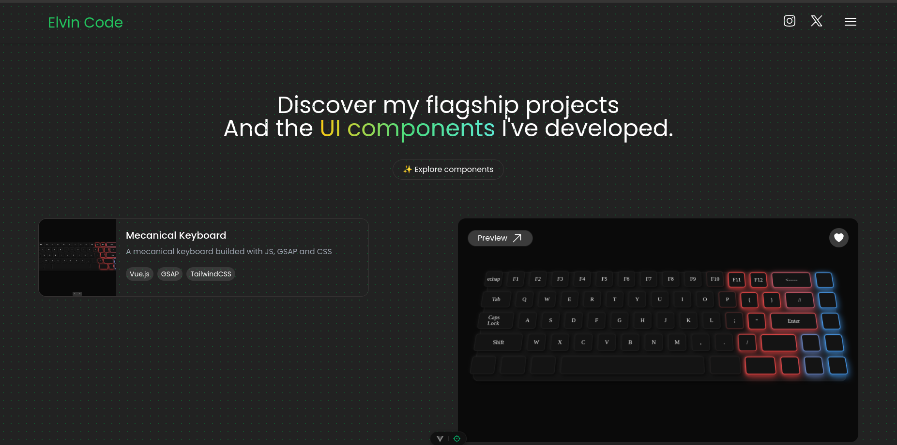

# README



## Bienvenue sur **Elvin Code** 👨‍💻

**Elvin Code** est mon portfolio interactif où je partage mon parcours en tant que développeur frontend. Vous y découvrirez mes projets, mes expériences, mes articles et conférences, ainsi qu'une sélection de composants UI que j'ai développés. Ce portfolio est un espace où je mets en avant ma passion pour la création de solutions web dynamiques et modernes.

### URL
[Explorez Elvin Code ici](https://elvincode.com/)

---

## Structure du site 🗂

### 1. **Homepage**
Sur la page d'accueil, vous trouverez une introduction à mon travail, une sélection de mes projets les plus récents, ainsi qu'une brève présentation de mes compétences clés en développement web.

### 2. **About**
La section **À propos** met en lumière mon parcours professionnel, mes motivations, et les différentes communautés tech dans lesquelles je suis activement impliqué.

### 3. **Components**
Découvrez une bibliothèque de composants UI que j'ai créés, mettant en avant mon expertise dans l'utilisation de **Vue.js**, **TailwindCSS**, et **GSAP** pour développer des interfaces dynamiques et fluides.

### 4. **Experiences**
Cette section détaille mes expériences professionnelles, allant de projets personnels aux collaborations avec des startups et des entreprises internationales. Chaque expérience est accompagnée des technologies utilisées et des résultats obtenus.

### 5. **Articles et Conférences**
Retrouvez ici mes articles de blog, où je partage des insights techniques, ainsi que mes interventions dans des conférences sur des sujets liés au développement web et aux communautés tech.

---

## Technologies utilisées 🚀

- **TypeScript (TS)** : Pour une gestion de types avancée et une meilleure robustesse du code.
- **Vue.js** : Pour une interface utilisateur réactive et performante.
- **Tailwind CSS** : Pour un design moderne, responsive, et rapide à intégrer.
- **GSAP** : Pour des animations fluides et immersives.

---

## Installation 🔧

Vous souhaitez cloner et exécuter le projet localement ? Voici comment faire :

1. **Clonez le dépôt** :
   ```bash
   git clone https://github.com/ElvinKyungu/elvin-code

2. **Accédez au répertoire du projet :** :
   ```bash
   cd elvin-code

3. **Installez les dépendances** :
   ```bash
   npm install

3. **Démarrez le serveur de développement** :
   ```bash
   npm run dev